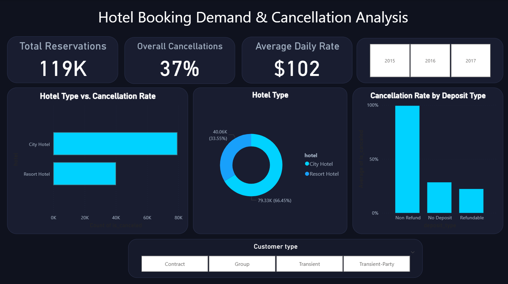

🏨 Hotel Booking Demand & Cancellation Prediction

A Business Analytics capstone project following the **CRISP-DM methodology** to identify key cancellation drivers and build predictive classification models to mitigate inventory loss.

---

## 📊 Executive Dashboard Preview

---

## 📌 Project Architecture & Tools
- **Methodology:** Cross-Industry Standard Process for Data Mining (CRISP-DM)
- **Predictive Modeling:** IBM SPSS Modeler (Logistic Regression, C5.0 Decision Trees, Auto Classifier)
- **Business Intelligence:** Microsoft Power BI Desktop
- **Data Source:** Hotel booking transactions dataset (~119k records)

---

## 🔍 Key Findings & Business Insights
- **Deposit Policy Paradox:** Bookings categorized under "Non Refund" policies exhibited an unexpected ~99% cancellation rate, primarily driven by speculative third-party group room blocks.
- **Channel Exposure:** Online Travel Agencies (OTAs) accounted for over 50% of all canceled reservations.
- **Lead Time Sensitivity:** Extended booking lead times significantly correlate with elevated cancellation probabilities.

---

## 🛠️ Repository Contents
| File / Asset | Description |
| :--- | :--- |
| `Hotel_Booking_Cancellation_Prediction.str` | IBM SPSS Modeler Stream (Data prep, modeling, and operational scoring) |
| `Hotel Booking Cnacellation Analysis.pbix` | Interactive Power BI Executive Dashboard |
| `High_Risk_Cancellations_Action_List.csv` | Scored operational deployment file isolating bookings with $P(\text{cancellation}) \ge 0.70$ |
| `hotel_bookings.csv` | Source transactional dataset |

---

## 🚀 Deployment Strategy
Using an operational scoring stream, reservations flagged with a cancellation probability $\ge 0.70$ are systematically routed into an action list for front-desk pre-authorization and overbooking calibration.
